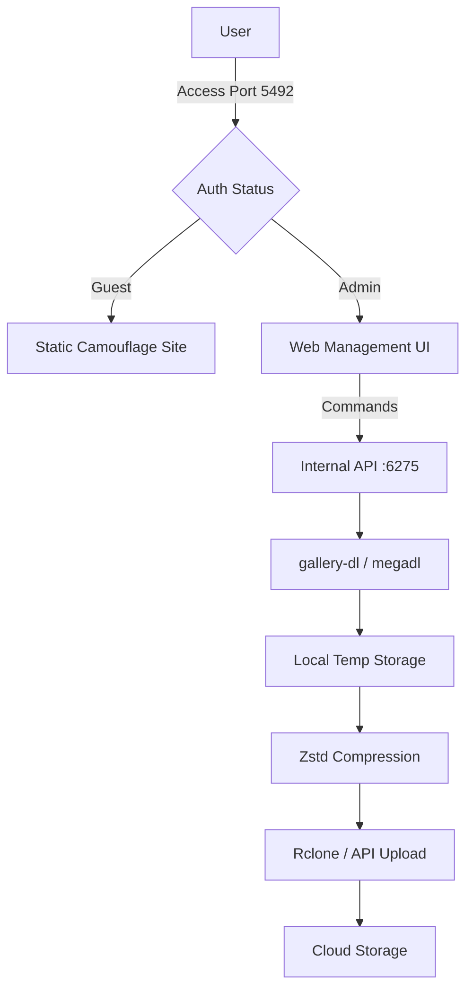

# Web-DL-Manager 🚀

[](https://github.com/Jyf0214/web-dl-manager/actions/workflows/docker-publish.yml)
[](https://github.com/Jyf0214/web-dl-manager)
[](LICENSE)

**Web-DL-Manager** 是一款专为私有化部署设计的自动化下载与云端分发管理系统。它不仅为 `gallery-dl` 和 `megadl` 提供了现代化的 Web 界面，更集成了一套从**高效抓取**、**极速压缩**到**多云端自动上传**的完整工作流。

---

## ✨ 核心特性

### 1. 🛡️ 安全隔离架构 (Camouflage Mode)
- **双应用设计**：系统同时运行两个 FastAPI 实例：
  - **伪装层 (Port 5492)**：对外公开。未登录用户访问时展现为普通静态站点（如博客），有效隐藏工具属性。
  - **核心层 (Port 6275)**：对内管理。处理下载、归档及上传等高权限操作。
- **反探测**：隐藏所有敏感 API 响应，仅在身份验证后暴露管理入口。

### 2. 📥 强大的下载能力
- **Gallery-dl 集成**：原生支持数百个图片/视频站点的深度抓取（如 DeviantArt, Pixiv, Twitter 等）。
- **Mega.nz 支持**：通过 `megadl` 协议直接抓取公共链接内容。
- **智能代理管理**：支持自定义 HTTP/SOCKS5 代理，并具备公共代理自动轮换机制，规避速率限制。

### 3. 📦 工业级归档逻辑
- **Zstd 极速压缩**：采用 Facebook 开源的 Zstandard 算法，在保持高压缩比的同时提供极快的处理速度。
- **智能分卷压缩**：自动根据目标存储限制进行分卷打包，完美适配对单文件大小有限制的云端服务。
- **自动清理**：任务完成后自动清除临时文件，确保磁盘空间持续健康。

### 4. ☁️ 全方位云端存储支持
- **Rclone 驱动**：通过集成的 rclone 核心支持 WebDAV, S3 (AWS, Cloudflare R2, Minio), Backblaze B2, MEGA 等。
- **第三方 API 适配**：原生对接 `gofile.io` 无限存储方案。
- **Openlist/Alist 联动**：支持自建网盘的快速上传。

### 5. 📊 实时任务监控
- **实时日志流**：基于 WebSocket/长轮询的实时控制台输出，无需刷新即可掌握下载进度。
- **状态看板**：一键查看服务器负载、带宽占用及任务历史。

---

## 架构图解



---

## 🚀 快速开始

### 方式一：Docker (推荐)

```bash
docker run -d \
  --name web-dl-manager \
  -p 5492:5492 \
  -v ./data:/data \
  -e APP_USERNAME="admin" \
  -e APP_PASSWORD="your_password" \
  -e STATIC_SITE_GIT_URL="https://github.com/your/blog.git" \
  ghcr.io/jyf0214/web-dl-manager:main
```

### 方式二：Docker Compose

```yaml
services:
  web-dl:
    image: ghcr.io/jyf0214/web-dl-manager:main
    ports:
      - "5492:5492"
    volumes:
      - ./gallery-dl-data:/data
    environment:
      - DATABASE_URL=sqlite:///data/manager.db
      - APP_USERNAME=admin
      - APP_PASSWORD=secure_pass
      - PRIVATE_MODE=true
```

---

## 环境变量配置

| 变量 | 描述 | 默认值 |
| :--- | :--- | :--- |
| `APP_USERNAME` | 管理员用户名 | `Jyf0214` |
| `APP_PASSWORD` | 管理员密码 | (空) |
| `STATIC_SITE_GIT_URL` | 伪装站点 Git 仓库 | - |
| `PRIVATE_MODE` | 私有模式（强制登录后可见） | `false` |
| `DEBUG_MODE` | 调试模式（详细日志） | `false` |
| `WDM_WEBDAV_URL` | 预设 WebDAV 地址 | - |
| `TUNNEL_TOKEN` | Cloudflare Tunnel 令牌 | - |

---

## 技术栈

- **Backend**: FastAPI (Python)
- **Frontend**: Bootstrap 5 + Jinja2
- **Database**: SQLite / MySQL (via SQLAlchemy)
- **Process Management**: PM2 / Ecosystem.js
- **Tools**: rclone, gallery-dl, megadl, zstd

---

## 免责声明

本工具仅供学习与研究使用。用户在使用本程序下载互联网资源时，需严格遵守当地法律法规以及目标网站的《服务条款》。开发者不对用户因使用本工具而产生的任何版权纠纷或法律后果承担责任。

---

## 贡献与反馈

欢迎提交 PR 或 Issue。如果觉得好用，请给个 ⭐！
